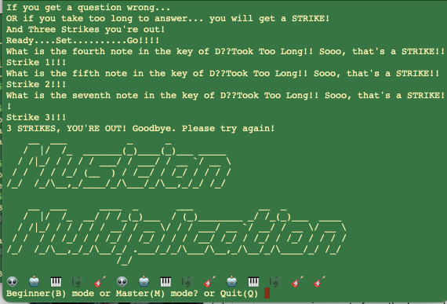

# Musician Multiplication 🎵✖️

**Musician Multiplication** is a music training app written in Python, designed to help you master music theory concepts the same way you mastered multiplication tables as a kid! Featuring built-in timers and two challenge modes, this app is perfect for musicians looking to level up their skills.



## Features 🚀

- **Beginner Mode**: Start simple and work your way up as you memorize key signatures and their associated notes.
- **Master Mode**: For the daring! Test your ability to name any note of a major or minor key and identify its scale degree (e.g., 1, 2, 7 of the key).
- **Interactive and Fun**: Learn music theory through an engaging, interactive experience.

## Why Use Musician Multiplication? 🎼

- Memorize your **major and minor key signatures**.
- Identify scale degrees and their corresponding notes with ease.
- Strengthen your foundation in music theory in an enjoyable and systematic way.

## Usage 🛠️

1. Clone the repository:

   ```bash
   git clone https://github.com/exitvillain/musician-multiplication.git

   python musician_multiplication.py


## Requirements 🖥️
Python 3.x
No external dependencies needed! (Lightweight and ready to use.)

## Contributing 🤝
Have suggestions or ideas? Contributions are welcome! Feel free to fork the repository, make improvements, and submit a pull request.
